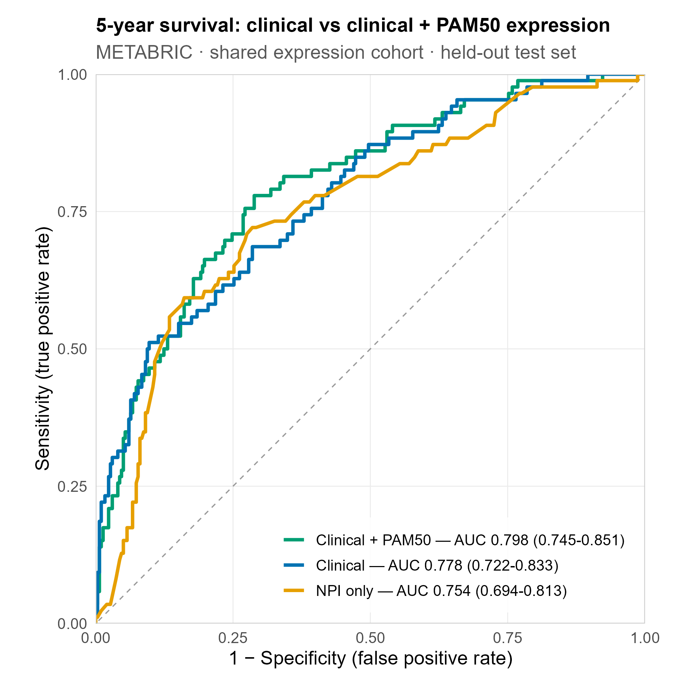
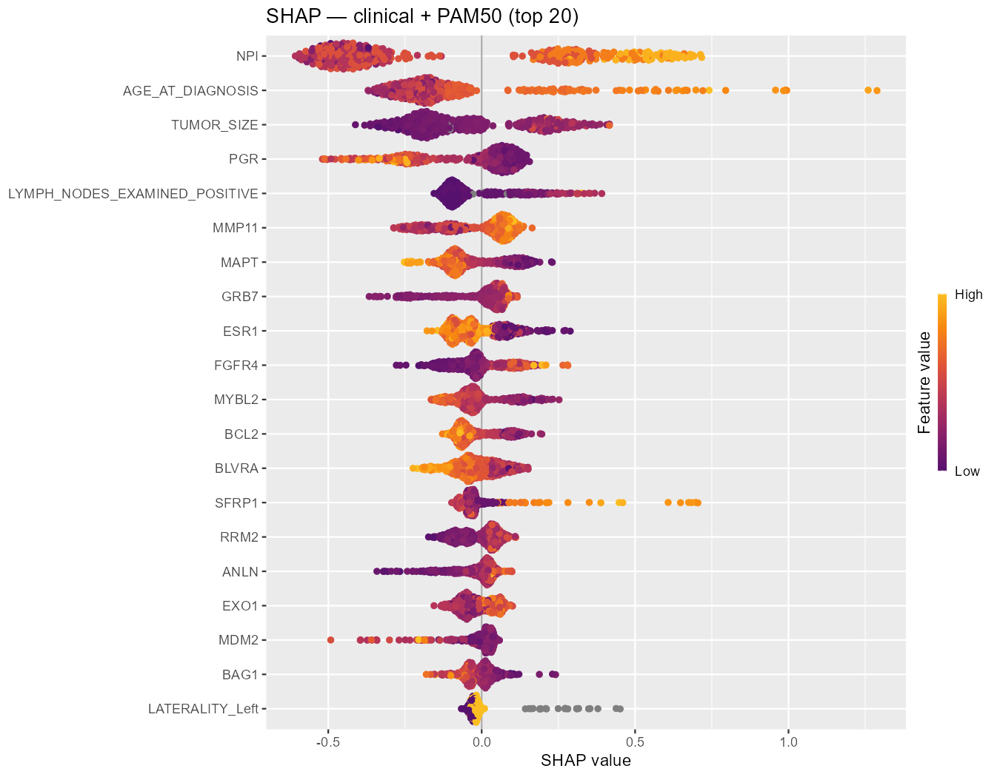
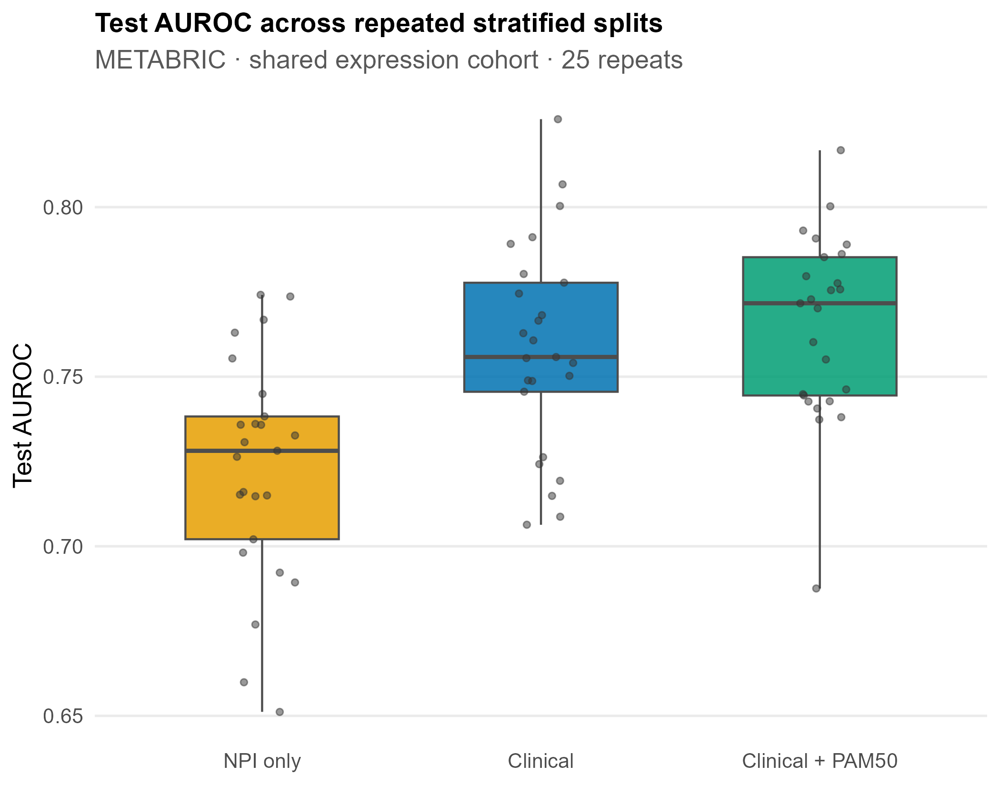
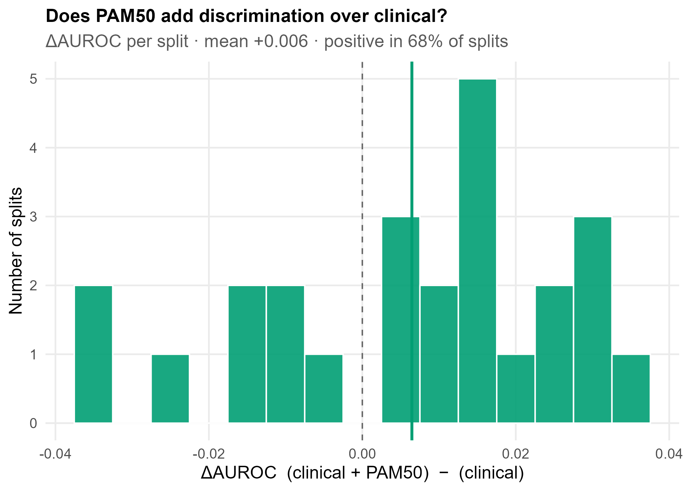

# Predicting 5-Year Breast-Cancer Survival: Does Gene Expression Add Value Over Clinical Data?

A machine-learning study on the public **METABRIC** breast-cancer cohort evaluating whether a PAM50 gene-expression signature improves 5-year overall-survival prediction beyond standard clinicopathologic variables. PAM50 is a validated 50-gene panel that classifies breast tumours into intrinsic molecular subtypes. The repository is organised in two parts: a **Background and Summary** intended to be readable without a technical background, followed by a formal **Methods, Results, and Discussion** section. This is a personal research project and is not a clinical decision tool.

---

# Part 1 — Background and Summary

## Clinical context

Prognostic assessment in breast cancer has traditionally relied on clinicopathologic variables — tumour size, histological grade, and lymph-node involvement — often summarised in a single index such as the Nottingham Prognostic Index (NPI). Molecular profiling now permits the additional characterisation of tumour **gene-expression** activity. A recurring question in oncology is whether such molecular data provide prognostic information beyond that already contained in routinely measured clinical variables. This project addresses that question directly.

## Dataset

The analysis uses **METABRIC** (Molecular Taxonomy of Breast Cancer International Consortium), a publicly available cohort of approximately 2,500 primary breast tumours annotated with clinical variables, gene expression, copy-number and mutation data, and long-term survival outcomes. The processed data were obtained from [cBioPortal](https://www.cbioportal.org/study/summary?id=brca_metabric); only raw sequencing files are access-restricted, and no patient-level data are redistributed in this repository.

The analytic cohort comprises the **1,916 patients** with both available expression data and a determinable 5-year survival status (1,489 alive at five years; 427 deceased within five years). All models were trained and evaluated on this common cohort to ensure comparability.

## Objective

To predict 5-year overall survival from information available at diagnosis, and to compare three models of increasing complexity:

1. **NPI only** — logistic regression on the Nottingham Prognostic Index (an established clinical baseline);
2. **Clinical** — a gradient-boosted model using the full set of clinicopathologic variables;
3. **Clinical + PAM50** — the same model additionally supplied with the 50-gene PAM50 expression signature.

The principal comparison is model 3 versus model 2, which isolates the incremental prognostic value of gene expression.

## Evaluation metrics

**AUROC** (area under the receiver-operating-characteristic curve) is the probability that the model assigns a higher predicted risk to a randomly chosen patient who died than to one who survived. A value of 0.5 indicates discrimination no better than chance, and 1.0 indicates perfect discrimination; values of approximately 0.75–0.80, as observed here, indicate moderate discriminative ability.

**DeLong's test** provides a p-value for the difference between two AUROC estimates computed on the same patients, indicating whether an observed performance difference is likely to reflect a genuine effect rather than sampling variability. A p-value below 0.05 is conventionally interpreted as evidence against the difference arising by chance.

## Summary of findings

On a single held-out test set, discrimination increased modestly with model complexity (NPI 0.754; clinical 0.778; clinical + PAM50 0.798).

Feature-attribution analysis indicated that standard clinical variables (age, tumour size, nodal status, receptor status) were the dominant predictors, with PAM50 genes contributing only marginally.

Repeated resampling confirmed that the full clinical model consistently outperformed the NPI baseline, whereas the addition of PAM50 expression produced no consistent improvement over clinical variables alone. The overall conclusion is that a comprehensive clinicopathologic model improves upon the classical index, while the PAM50 signature provides no reliable incremental discrimination once clinical variables are included — consistent with prior evidence that much of the prognostic signal in expression signatures is correlated with established clinical factors.

---

# Part 2 — Methods, Results, and Discussion

## Methods

### Outcome definition

Right-censored survival was reformulated as **binary classification at a 5-year (60-month) horizon**. Patients who died within 60 months were labelled positive; those known to be alive at ≥60 months (or who died subsequently) were labelled negative. Patients alive but censored before 60 months have an undetermined 5-year status and were **excluded rather than imputed**, as labelling them as survivors would introduce systematic outcome misclassification. This constitutes the most consequential design decision in the pipeline. A time-to-event formulation (e.g. Cox proportional-hazards or accelerated-failure-time models) would retain the discarded follow-up information; this is addressed under Limitations.

### Data processing

Patient- and sample-level clinical tables were merged on `PATIENT_ID`; the expression matrix (genes × samples) was transposed and linked to patients via `SAMPLE_ID`. Expression columns are sample identifiers of the form `MB-0000`; the matrix was therefore read with `check.names = FALSE` to prevent silent character substitution that would invalidate the join. All models were restricted to the shared cohort of 1,916 patients to avoid confounding feature-set comparisons with differences in population.

### Feature construction

The clinicopathologic feature set (57 columns after one-hot encoding) comprised age at diagnosis, tumour size, positive lymph nodes, grade, stage, NPI, cellularity, ER/PR/HER2 status, menopausal state, treatment variables, surgery type, and histology. The genomic feature set was the PAM50 signature, of which 49 of 50 genes matched the array annotation (`ORC6L` is a synonym of `ORC6` and is absent under that symbol; this reflects nomenclature, not missing data), yielding a combined matrix of 106 columns.

A custom one-hot encoder preserved missing values as `NA`, enabling XGBoost's native handling of missingness rather than imputation. Identifiers and outcome-derived fields (`OS_MONTHS`, `OS_STATUS`, `VITAL_STATUS`) were excluded from the feature space to prevent target leakage. The expression-derived classifiers `CLAUDIN_SUBTYPE`, `THREEGENE`, and `INTCLUST` were also excluded from the clinical feature set, since their inclusion would embed molecular information within the "clinical" model and confound the clinical-versus-genomic comparison.

### Models

| Model | Algorithm | Feature set |
|-------|-----------|-------------|
| NPI only | Logistic regression | NPI (1 predictor) |
| Clinical | XGBoost | clinicopathologic (57) |
| Clinical + PAM50 | XGBoost | clinical + PAM50 (106) |

XGBoost hyperparameters were `objective = binary:logistic`, `eval_metric = auc`, `max_depth = 4`, `eta = 0.05`, `subsample = 0.8`, `colsample_bytree = 0.8`, and `min_child_weight = 5`. Shallow trees, a low learning rate, and stochastic row/column subsampling were selected to constrain overfitting given the cohort size. Class imbalance (survivors:deaths ≈ 3.5:1) was addressed via `scale_pos_weight`, set to the training-set negative-to-positive ratio. The number of boosting rounds was determined by 5-fold cross-validation with early stopping (maximum 1,000 rounds; termination after 30 rounds without improvement in cross-validated AUC).

### Evaluation

Discrimination was quantified by AUROC with 95% confidence intervals (DeLong method, `pROC::ci.auc`). Pairwise differences between models were assessed using DeLong's test for correlated ROC curves, computed on identical held-out patients to ensure a valid paired comparison. All performance estimates were obtained on a stratified 20% hold-out set not used during training.

### Interpretability

Feature contributions were quantified using SHAP (SHapley Additive exPlanations) values via the `shapviz` package, providing per-feature attribution of predicted risk for the clinical + PAM50 model.

### Robustness analysis

Because estimates from a single partition are subject to sampling variability, the full procedure was repeated across **25 stratified resamplings**, each with an independent 80/20 split. For each resampling, all three models were trained and evaluated on the same held-out patients, and per-model AUROC and paired between-model differences were recorded. To reduce computation, the number of boosting rounds was tuned once per feature set (clinical = 59; clinical + PAM50 = 56) and held fixed across resamplings; as this constraint applied identically to both XGBoost models, the between-model comparison remained unbiased.

### Reproducibility

A fixed global seed and deterministic per-resampling seeds ensure reproducible results. The analysis was implemented in R using `xgboost`, `shapviz`, `pROC`, `ggplot2`, and `data.table`. Data are not included in the repository; acquisition instructions are provided in [`data/README.md`](data/README.md).

## Results

### Single held-out test set (n = 1,916 cohort)

| Model | AUROC (95% CI) |
|-------|----------------|
| NPI only | 0.754 (0.694–0.813) |
| Clinical | 0.778 (0.722–0.833) |
| Clinical + PAM50 | 0.798 (0.745–0.851) |

| Comparison | ΔAUROC | DeLong *p* |
|------------|--------|-----------|
| Clinical vs NPI | +0.024 | 0.300 |
| Clinical + PAM50 vs Clinical *(primary comparison)* | +0.021 | 0.195 |
| Clinical + PAM50 vs NPI | +0.045 | 0.040 |

On this partition, only the cumulative clinical + PAM50 model differed significantly from the NPI baseline; neither incremental step (clinical over NPI, or PAM50 over clinical) reached significance individually.

### Repeated resampling (25 stratified splits)

| Model | Mean AUROC (2.5–97.5%) |
|-------|------------------------|
| NPI only | 0.723 (0.656–0.774) |
| Clinical | 0.759 (0.708–0.814) |
| Clinical + PAM50 | 0.765 (0.717–0.807) |

| Comparison | Mean ΔAUROC | 2.5–97.5% | Proportion favourable |
|------------|-------------|-----------|-----------------------|
| Clinical vs NPI | +0.036 | +0.007 to +0.066 | 100% |
| Clinical + PAM50 vs Clinical | +0.006 | −0.034 to +0.033 | 68% |
| Clinical + PAM50 vs NPI | +0.042 | +0.006 to +0.085 | 100% |

The clinical model exceeded the NPI baseline in all 25 resamplings, with an interval excluding zero, indicating a small but consistent improvement. The incremental effect of PAM50 over the clinical model was centred near zero (mean +0.006), with an interval spanning zero and a favourable outcome in only 68% of resamplings, consistent with an effect indistinguishable from sampling noise.

**Statistical note.** Because the resamplings share overlapping training data, they are not independent, and no p-value was derived from the 25 differences (a paired t-test would substantially overstate significance). The resampling analysis characterises the stability of the estimates, whereas the DeLong test provides the formal paired significance test. The two are complementary: the clinical-versus-NPI advantage, ambiguous on a single split (p = 0.30), is shown to be robust across resamplings, whereas the PAM50 increment remains within noise under both analyses. The lower resampled means relative to the single split further indicate that the original partition was mildly optimistic.

## Discussion

Two conclusions follow. First, a full clinicopathologic model provides a small but reliable improvement in discrimination over the single-parameter NPI, reflecting information that gradient boosting extracts from the broader feature set. Second, the PAM50 expression signature confers no robust incremental discrimination beyond clinicopathologic variables for 5-year survival in this cohort. This is consistent with prior findings that a substantial proportion of the prognostic signal in gene-expression signatures is correlated with established clinical factors such as grade, tumour size, nodal status, and receptor status, limiting the marginal information available once these variables are modelled.

## Limitations

- With approximately 1,900 patients, statistical power to detect small differences in AUROC (~0.02) is limited; the absence of a detectable PAM50 effect should be interpreted as "no effect detected," not "no effect present."
- The analysis evaluates one fixed 50-gene signature and does not generalise to expression data more broadly.
- Findings derive from a single cohort; external validation (e.g. TCGA-BRCA) was not performed.
- Dichotomisation of survival at five years discards time-to-event information that a survival model would retain.

## References, data and code availability

METABRIC data: Curtis et al. (*Nature*, 2012) and Pereira et al. (*Nature Communications*, 2016), accessed via cBioPortal (Cerami et al. 2012; Gao et al. 2013). The PAM50 signature: Parker et al. (*Journal of Clinical Oncology*, 2009). The Nottingham Prognostic Index: Galea et al. (1992). Methods: XGBoost (Chen & Guestrin, 2016) and SHAP (Lundberg & Lee, 2017). Analysis code is provided in this repository; data must be obtained from cBioPortal.

**EstelleRD** 

*This is a personal research project for educational purposes. It does not constitute medical advice and is not a clinical decision tool.*
